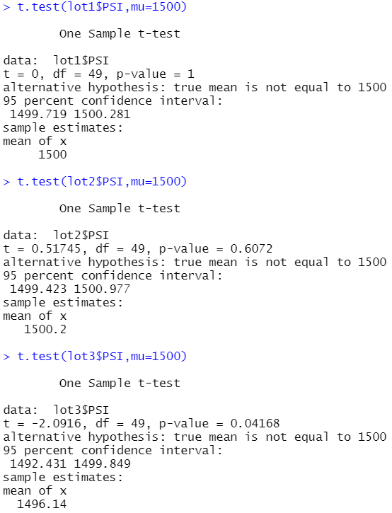

# Mecha Car Statistical Analysis
Using R to analyze data for AutosRUs' new prototype, MechaCar, and determine insights for the manufacturing team.

## Table of contents
* [Resources](#resources)
* [Linear Regression to Predict MPG](#linear-regression-to-predict-mpg)
* [Summary Statistics on Suspension Coils](#summary-statistics-on-suspension-coils)
* [T-Tests on Suspension Coils](#t-tests-on-suspension-coils)
* [Study Design: MechaCar vs Competition](#study-design-mechacar-vs-competition)

### Resources
Data Source: MechaCar_mpg.csv, Suspension_Coil.csv
Software: RStudio 2022.02.3

## Linear Regression to Predict MPG
Creating a linear regression shows us that:

- Vehicle length and ground clearance p-values indicate non-random variance on MPG
- The p-value of 5.35e-11 is smaller than a significance level of 0.05%
  - This indicates **the slope is not zero**
  - **We can reject the null hypothesis**
- The r-squared value of 0.7149 means approximately 71% of MPG predictions can be made with this model
  - This model can be used to predict MPG of MechaCar prototype effectively

## Summary Statistics on Suspension Coils
The design specifications for the MechaCar suspension coils dictate that the variance of the suspension coils must not exceed 100 pounds per square inch.

The total summary PSI variance falls within the requirement at 62.29.

Looking at the lot summary, we can see that Lot 1 and Lot 2 are also within the variance requirement. At 170.29, Lot 3 is above the variance requirement and causing disproportionate variance for the total summary.

## T-Tests on Suspension Coils
A summary of the t-test for all manufacturing lots shows a mean of 1498.78. With a p-value over 0.05 **there is not enough evidence to reject the null hypothesis**, the data is statistically similar to the presumed population mean of 1500.

The t-test for the lots also show means close to to the presumed population mean.
- Lot 1 and Lot 2's p-values are above the 0.05 significance level so **the null hypothesis can't be rejected**
- With a p-value of 0.04 and mean of 1496.14, Lot 3 is statistically different, and we **can reject the null hypothesis**
  - Something in Lot 3's production cycle is going wrong and needs to be checked 

## Study Design: MechaCar vs Competition
In order to compare performance of MechaCar against the competition, we should collect data on the following metrics:
- Current selling price
- Fuel efficiency
  - City
  - Highway
- Engine type (electric, hybrid, gas)
- Vehicle type (compact, SUV, etc.)
- Safety rating

Using these metrics, we can test our hypotheses:
- Null: MechaCar is priced comparably to competitors with similar performance factors. 
- Alternative: MechaCar is not priced comparably to competitors with similar performance factors.

A multiple linear regression could be used to determine which factors have the highest correlation with the selling price (dependent variable).
